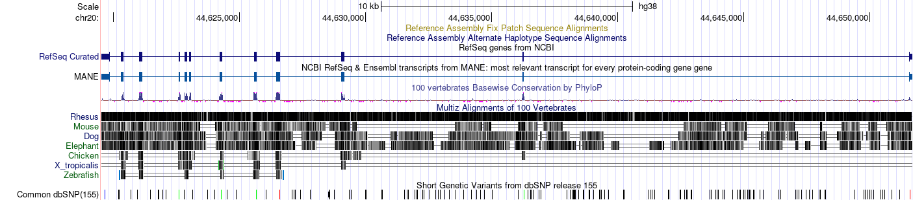
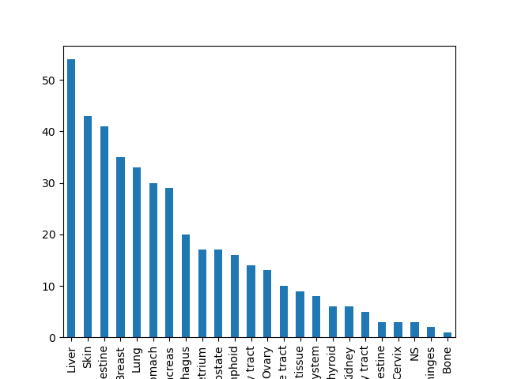

# Exercises for Variation databases

While searching databases pick 10 amino acid substitutions, insertions, and deletions for further analyses, if available.

Investigate your gene and find out from

## SwissProt

1. What types of variants are there?

2. What is the total number of variants?

    As in Excercise 3:
    | Total:           | 595 |
    | :--------------- | :-- |
    | missense         | 526 |
    | frameshift       | 33  |
    | stop gained      | 28  |
    | -                | 5   |
    | stop lost        | 2   |
    | inframe deletion | 1   |

## UCSC browser

1. Visualize human mRNAs in your gene
    

## dbSNP

1. How many SNVs are there in total in your gene? And of which types.
    13268, and types: {del, delins, ins, mnv}
2. How many intron variants and how many frameshift variants are there?
    Search term: (ADA[Gene Name]) AND Homo Sapiens[Organism] AND intron variant[Function_Class]  
    Outcome: 11554 intron variants

    >Is this web page entries unique by id?

    Search term: ADA[Gene Name] AND Homo Sapiens[Organism] AND frameshift[Function_Class]
    Putcome: no result

## ClinVar

1. Are there insertions and untranslated region variants in your gene?
    There is on insertion in the UTR in ADA
2. What can you say about reliability of these variant data?
This record is from one submitter. I would say it's not very convincing yet. ~~There's review supporting the classification saying
Uncertain significance, meaning the association of this variance to the suggested disease is not certain.~~

    > Notice the defaut ClinVar web uses GRCh37. While I chose GRCh38 in the UCSC browser section.

## Frequency

1. Investigate frequencies for a couple of variants.
    On dbSNP (rs) report, the rs244074 has alleles G>A / G>T with frequency

    | A   | 0.0000 | (0/4470, ALFA)   |
    | :-- | :----- | :--------------- |
    | G   | 0.0000 | (0/2930, KOREAN) |
    | T   | 0.0000 | (0/2930, KOREAN) |

## GWAS catalog

### How many associations are there and in what traits?

    14 associations and 12 traits:

|                                                        | MAPPED_TRAIT |
| :----------------------------------------------------- | :----------- |
| serum metabolite measurement                           | 3            |
| aseptic loosening, revision of total knee arthroplasty | 1            |
| adenosine deaminase measurement                        | 1            |
| N1-methyladenosine measurement                         | 1            |
| mitochondrial DNA measurement                          | 1            |
| blood protein measurement                              | 1            |
| type 2 diabetes mellitus                               | 1            |
| body fat percentage                                    | 1            |
| apolipoprotein A 1 measurement                         | 1            |
| total cholesterol measurement                          | 1            |
| Drugs used in diabetes use measurement                 | 1            |
| birth weight, pelvic organ prolapse                    | 1            |

### Do the results make medical sense in regards to what is known about your gene?

This gene is a adenosine deaminase. It makes sense to associate with adenosine deaminase measurement and N1-methyladenosine measurement and in metabolic traits.

## COSMIC

1. How many variants cause amino acid substitutions?
    Download tsv for mutations from Cosmos and count the Type contains Substitution: 155
2. Look at a half a dozen variants, what can you say about their tissue distribution?
The point mutations in general low occurance in the samples. In the positive samples,it occurs mosty in the liver. The distribution is likely fitting in a second order curve.
    
3. How does the tissue distribution correlate with the primary disease of the gene?
    In uniprot, the variants related disease: Severe combined immunodeficiency autosomal recessive T-cell-negative/B-cell-negative/NK-cell-negative due to adenosine deaminase deficiency (ADASCID)  
    It's hard to link, probably because immunity has systematic effects, or lack of disease reports.

## Variant naming

1. Generate systematic names at different levels for the selected variants
    - DNA level:
    - RNA level:
    - Protein level:
